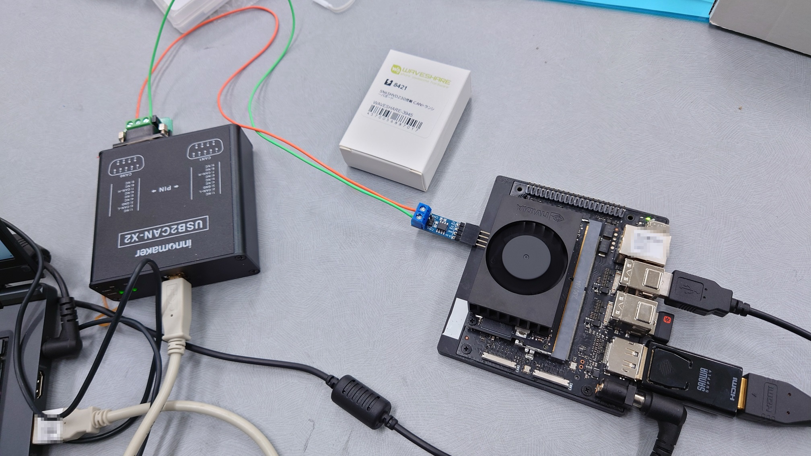

# Jetson Orin NANO で CAN を使う

## 使用機材

- Jetson Orin NANO
- [WaveShare SN65HVD230 CAN board](https://www.switch-science.com/products/8421)
- `CAN`のインタフェースを持つ通信相手。`PC`の場合は[USB2CAN-X2-Device](https://www.inno-maker.com/product/usb2can-x2-device/)等を使う。
  - 本稿では`PC`+`USB2CAN-X2-Device`を使っていることを前提とする。

機材を接続した様子は下図の通り。
`CAN_L`同士、`CAN_H`同士を結線する。



## Jetson Orin NANO の設定

基本的には[Controller Area Network (CAN)](https://docs.nvidia.com/jetson/archives/r35.3.1/DeveloperGuide/text/HR/ControllerAreaNetworkCan.html#controller-area-network-can)
に従う。

```shell
sudo apt-get install can-utils
sudo modprobe can
sudo modprobe can_raw
sudo modprobe mttcan
sudo ip link set can0 down
sudo ip link set can0 up type can bitrate 500000 dbitrate 1000000 berr-reporting on fd on
ifconfig can0
```

- 実行結果

```shell
can0: flags=193<UP,RUNNING,NOARP>  mtu 72
        unspec 00-00-00-00-00-00-00-00-00-00-00-00-00-00-00-00  txqueuelen 10  (不明なネット)
        RX packets 2  bytes 10 (10.0 B)
        RX errors 0  dropped 0  overruns 0  frame 0
        TX packets 2  bytes 10 (10.0 B)
        TX errors 0  dropped 0 overruns 0  carrier 0  collisions 0
        device interrupt 111
```

### Jetson Orin NANO 設定の永続化

```shell
sudo emacs /etc/modprobe.d/denylist-mttcan.conf -nw
```

先頭に`#`をつけてコメントアウトする。

```text
# blacklist mttcan
```

```shell
sudo emacs /etc/modules-load.d/can.conf -nw
```

以下を書き込む。

```text
can_raw
can
```

再起動して確認する。

```shell
lsmod|grep can
```

- 実行結果

```shell
mttcan                 65536  0
can_dev                32768  1 mttcan
can_raw                28672  0
can                    28672  1 can_raw
```

```shell
sudo emacs /etc/systemd/network/80-can.network -nw
```

`80-can.network`に以下を書き込む。

```text
[Match]
Name=can*

[CAN]
BitRate=500K
RestartSec=100ms
DBitRate=1000K
FDMode=yes
```

保存して以下を実行する。

```shell
sudo systemctl enable systemd-networkd
```

- 実行結果

```shell
Created symlink /etc/systemd/system/dbus-org.freedesktop.network1.service → /lib/systemd/system/systemd-networkd.service.
Created symlink /etc/systemd/system/multi-user.target.wants/systemd-networkd.service → /lib/systemd/system/systemd-networkd.service.
Created symlink /etc/systemd/system/sockets.target.wants/systemd-networkd.socket → /lib/systemd/system/systemd-networkd.socket.
Created symlink /etc/systemd/system/network-online.target.wants/systemd-networkd-wait-online.service → /lib/systemd/system/systemd-networkd-wait-online.service.
```

## 通信相手の設定

[USB2CAN-X2 User Manual](https://github.com/INNO-MAKER/USB2CAN-X2/blob/main/Document/USB2CAN-X2%20UserManual%20v.1.0.pdf)のP27に従う。
通信速度は`500KBPS`としている。

```shell
sudo ip link set can0 down
sudo ip link set can0 type can bitrate 500000
sudo ip link set can0 up
ifconfig can0
```

- 実行結果
  
```shell
can0: flags=193<UP,RUNNING,NOARP>  mtu 16
        unspec 00-00-00-00-00-00-00-00-00-00-00-00-00-00-00-00  txqueuelen 10  (不明なネット)
        RX packets 2  bytes 10 (10.0 B)
        RX errors 0  dropped 0  overruns 0  frame 0
        TX packets 0  bytes 0 (0.0 B)
        TX errors 0  dropped 0 overruns 0  carrier 0  collisions 0
```

### [USB2CAN-X2-Device](https://www.inno-maker.com/product/usb2can-x2-device/)設定の永続化

```shell
sudo emacs /etc/systemd/network/80-can.network -nw
```

- `80-can.network`に以下を書き込む。

```text
[Match]
Name=can*

[CAN]
BitRate=500K
RestartSec=100ms
```

- 保存して以下を実行する。

```shell
sudo systemctl enable systemd-networkd
```

- 実行結果

```shell
Created symlink /etc/systemd/system/dbus-org.freedesktop.network1.service → /lib/systemd/system/systemd-networkd.service.
Created symlink /etc/systemd/system/multi-user.target.wants/systemd-networkd.service → /lib/systemd/system/systemd-networkd.service.
Created symlink /etc/systemd/system/sockets.target.wants/systemd-networkd.socket → /lib/systemd/system/systemd-networkd.socket.
Created symlink /etc/systemd/system/network-online.target.wants/systemd-networkd-wait-online.service → /lib/systemd/system/systemd-networkd-wait-online.service.
```

再起動後に`ifconfig`で確認する。

```shell
ifconfig can0
```

- 実行結果

```shell
can0: flags=193<UP,RUNNING,NOARP>  mtu 16
        unspec 00-00-00-00-00-00-00-00-00-00-00-00-00-00-00-00  txqueuelen 10  (不明なネット)
        RX packets 0  bytes 0 (0.0 B)
        RX errors 0  dropped 0  overruns 0  frame 0
        TX packets 0  bytes 0 (0.0 B)
        TX errors 0  dropped 0 overruns 0  carrier 0  collisions 0
```

```shell
ifconfig can1
```

- 実行結果

```shell
can1: flags=193<UP,RUNNING,NOARP>  mtu 16
        unspec 00-00-00-00-00-00-00-00-00-00-00-00-00-00-00-00  txqueuelen 10  (不明なネット)
        RX packets 0  bytes 0 (0.0 B)
        RX errors 0  dropped 0  overruns 0  frame 0
        TX packets 0  bytes 0 (0.0 B)
        TX errors 0  dropped 0 overruns 0  carrier 0  collisions 0
```

## 通信のテスト

通信相手側はCANデータの受信を待つ。

```shell
candump can0
```

`Jetson`側で以下を実行する。

```shell
cansend can0 123#1234567890
cansend can0 721#0987654321
```

受信側に以下が表示されたら成功

```shell
can0  123   [5]  12 34 56 78 90
can0  721   [5]  09 87 65 43 21
```
